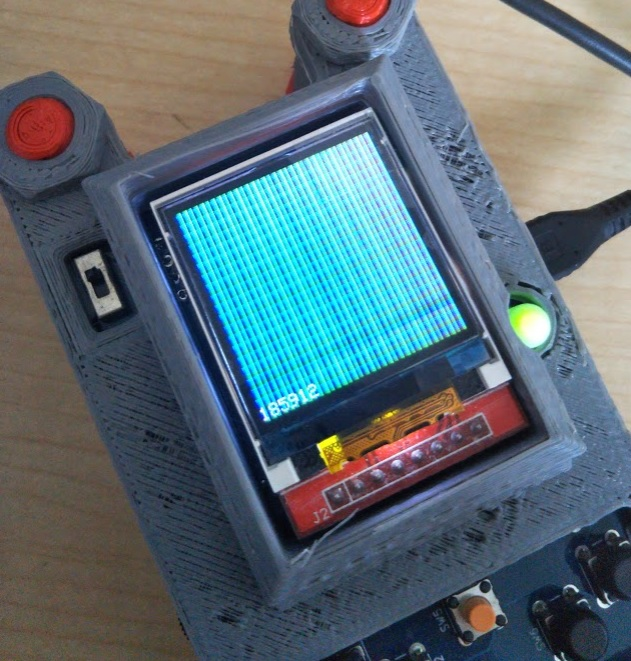

ESP32 WASM - TFT example

AssemblyScript as game script example.

You can only use `pset`, `color`, `delay`, `millis`, `print`.



[Source of above ScreenShot in AssemblyScript](./wasm/assembly/index.ts)

```
import * as dev from "./arduino";

let y = 0;
let t = 0;

function run(): void {
  dev.println('Hello1!');
  for(let y = 0; y < 128; y ++){
    for(let x = 0; x < 128; x ++){
      dev.color((x)%255, (t*t*x)%255, (t*y)%255);
      dev.pset(x, y);
    }
  }
  t ++;
}

export function _start(): void{
    run();
}
```

## setup

```
$ cd wasm
$ yarn install
```

## build AssemblyScript

```
$ cd wasm
$ yarn run asbuild
```

## build ESP32 firmware

```
$ platformio run -e esp32
```

## circuit

Connect TFT screen and override `platformio.ini` like below.

```
  -DILI9163_DRIVER=1
  -DTFT_DRIVER=ILI9163
  -DTFT_WIDTH=128
  -DTFT_HEIGHT=128
  -D R0_OFFSET_Y=3
  -D R0_OFFSET_X=2
  -DTFT_MISO=12
  -DTFT_MOSI=13
  -DTFT_SCLK=14
  -DTFT_CS=15
  -DTFT_DC=19
  -DTFT_RST=18
  -DDAC_OUT=26
  -DLOAD_GLCD=1
  -DSPI_FREQUENCY=20000000
```

## Dependencies

- https://github.com/vanklompf/TFT_eSPI
  - fork of https://github.com/Bodmer/TFT_eSPI
  - is marged https://github.com/Bodmer/TFT_eSPI/pull/76
- https://github.com/AssemblyScript/assemblyscript 0.12.5
- https://github.com/wasm3/wasm3-arduino 0.4.5
